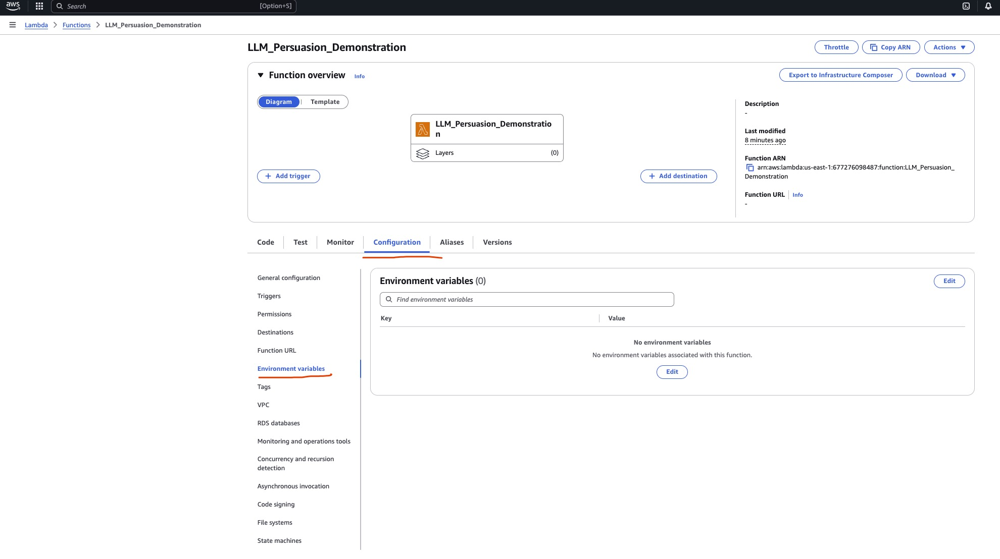
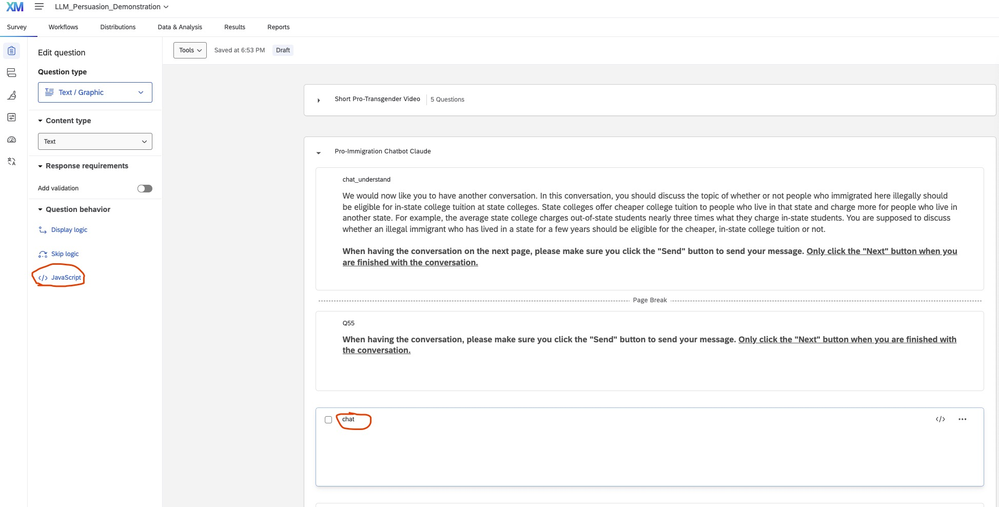
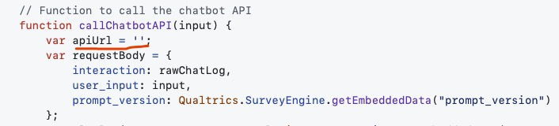
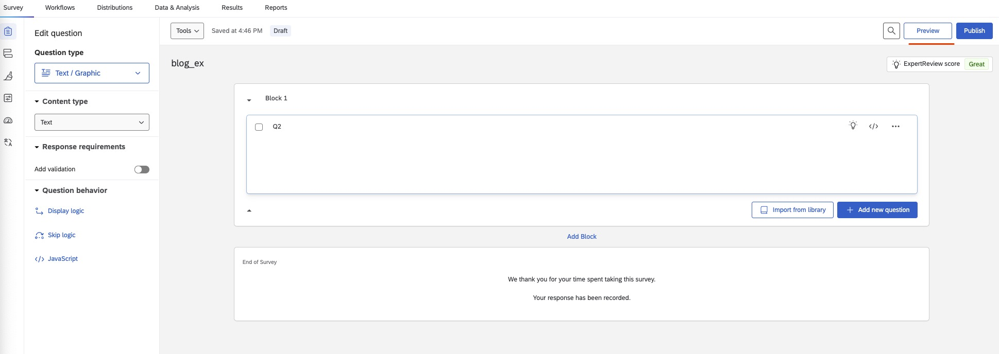
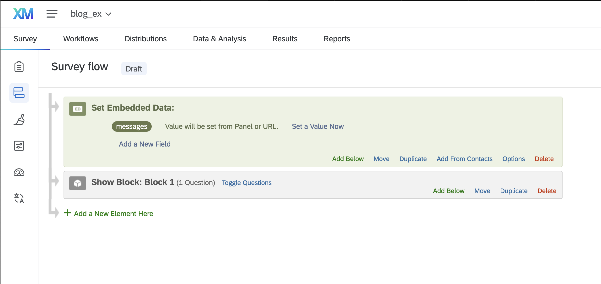

In [our research](https://arxiv.org/abs/2505.00036), we test the persuasive impact of LLM chatbots on various political topics. The surveys are implemented by integrating Qualtrics with Anthropic's Claude model via AWS services. In particular, we use AWS Bedrock for language model inference and AWS Lambda to process our requests from Qualtrics.

We are sharing this post to assist other researchers interested in embedding chatbots into their own Qualtrics surveys. This post is accurate as of June 2025. Please submit a pull request or reach out to Josh Kalla (josh(dot)kalla(at)yale(dot)edu) if you notice that any of this information is out of date.

The general workflow is as follows:
- Users interact with a chatbot in Qualtrics by typing out messages. After users send their message, we use embedded JavaScript to add this message to the conversation history, and send a request to our Lambda function.
- Our Lambda function receives this request, and formats a call to Bedrock. Here, we specify the system prompt and the model we're using. 
- Once Lambda obtains a response from Bedrock, we respond to the API request from Qualtrics, returning the model response.
- Qualtrics adds the model response to the conversation history, and makes this response visible to the user.

## Some Design Considerations

By using Lambda, users (survey participants) can only access our chat through the Lambda URL even if they examine the JavaScript embedded in Qualtrics. They have no access to our API keys and lack access to our system prompts. Further, we can later configure our Lambda function to call other LLM inference providers (e.g. OpenAI's ChatGPT or DeepSeek's R1). 

# Details

## Bedrock Setup
### ✅ Step 1: Setup AWS Account and Environment Variables for AWS Bedrock Access
Follow these steps to configure the required environment variables:

1. **Create or sign in to your AWS account.**

2. **Set up a user with Bedrock access** via IAM:
   - Go to the [IAM Console](https://console.aws.amazon.com/iam/).
   - Create a new user or select an existing one by selecting **Users** under **Access Management**.
   - After selecting the user, click **Add permissions**, **Attach policies directly**, and grant access to **AmazonBedrockFullAccess**.

3. **Generate access keys:**
   - Under the IAM user’s **Security credentials** tab, **create access key** with **Application running on an AWS compute service** option, and obtain both the **Access Key ID** and **Secret Access Key**.

## Lambda Function

The [Lambda function](https://aws.amazon.com/pm/lambda/) serves as the backend function that processes requests to and from Bedrock. The Lambda function calls the appropriate Bedrock model (e.g., Claude), and returns the model’s response. Here is a tutorial on creating a Lambda function for our chatbox.

### ✅ Step 2: Setup a Lambda Function in AWS

1. **Go to the AWS Lambda Console**:
   - https://console.aws.amazon.com/lambda/
2. **Click "Create a function"**.
3. **Choose "Author from scratch"** and configure:
   - **Function name**: e.g., `LLM_Persuasion_Demonstration`
   - **Runtime**: Choose `Python 3.13` 
   - **Permissions**: 
     - Under **Change default execution role**, select **"Create a new role with basic Lambda permissions"**
4. **Click "Create function"**.

### ✅ Step 3: Upload or Paste Your Code
First, write a Lambda function that invokes an LLM model through Amazon Bedrock. An example of such a Lambda function is shown below:

```python
import json, os, boto3

def lambda_handler(event, context):
    body = json.loads(event['body'])
    messages = body['messages']

    bedrock = boto3.client(
        service_name='bedrock-runtime',
        region_name=os.environ['BEDROCK_AWS_REGION'],
        aws_access_key_id=os.environ['BEDROCK_AWS_ACCESS_KEY_ID'],
        aws_secret_access_key=os.environ['BEDROCK_AWS_SECRET_ACCESS_KEY']
    )
    
    # Call Bedrock with the conversation history
    response = bedrock.invoke_model(
        modelId='us.anthropic.claude-3-5-sonnet-20241022-v2:0',
        contentType='application/json',
        accept='application/json',
        body=json.dumps({
            "anthropic_version": "bedrock-2023-05-31",
            # "system": version.system_prompt,
            "messages": messages,
            "max_tokens": 700,
            "temperature": 0.7,
            "top_p": 0.9
        })
    )
    print("BODY\n", body := json.loads(response['body'].read()))
    print("\nCLAUDE RESPONSE\n", claude_response := body["content"][0]["text"])

    return {
        'message': claude_response
    }
```
The environment variables `BEDROCK_AWS_REGION`, `BEDROCK_AWS_ACCESS_KEY_ID` and `BEDROCK_AWS_SECRET_ACCESS_KEY` can be obtained after setting up an AWS account with access to Bedrock. We'll configure them in the following step.

- Always remember to click **Deploy** to save your function after any changes.

### ✅ Step 4: Set Environment Variables

1. Click **Configuration**, then scroll to the **Environment variables** section.

    

2. Click **Edit**, then **Add environment variable** three times. Set the following **Keys** and provide the corresponding **Values** from your AWS IAM user credentials from Step 1 for each variable:

    - `BEDROCK_AWS_REGION` (e.g., us-east-1)
    - `BEDROCK_AWS_ACCESS_KEY_ID`
    - `BEDROCK_AWS_SECRET_ACCESS_KEY`

3. Don't forget to save.

### ✅ Step 5: Ensuring the LLM Model is Activated for Your AWS Account

- Open: [https://console.aws.amazon.com/bedrock](https://console.aws.amazon.com/bedrock)
- Select the appropriate AWS **region** (e.g., `us-east-1`) in the top-right corner. Bedrock is only available in certain regions.
- In the left sidebar, click **"Model catalog"** under the **Foundation models**.
- You'll see a list of available models. For the intended model, click it and click **Available to request** and click **"Request model access"**.


### Step 6: Testing

1. Navigate back to the **AWS Lambda Console** and select your function (e.g., LLM_Persuasion_Demonstration).
2. Select the **Test** tab, next to **Code**.
3. In the **Event JSON** editor, paste the following text:

```
{
  "body": "{\"messages\": [{\"role\": \"user\", \"content\": \"what is an llm?\"}]}"
}
```

3. Select **Test**, and verify that the output is somewhat reasonable. You will likely have to adjust the timeout: go back to to **Configuration** > **General Configuration** > **Edit**. Choose a suitable timeout, e.g. 1 min. To see the output, select **Details** under **Executing function: succeeded**.

4. Feel free to try other tests.

### Step 7: Provide access to your Lambda.

1. Select **Configuration** > **Function URL** > **Create Function URL**
2. Choose **NONE** for the Auth type.
3. Select **Additional Settings**, then **Configure cross-origin resource sharing**. Ensure that the **Allow origin** value is `*`
4. Select **Save** and copy your function URL.


## Qualtrics

We use JavaScript to create a chatbox interface for the survey participants (built off of [SMARTRIQS](https://www.smartriqs.com)). Below is a step-by-step tutorial.

### ✅ Step 8: Create a survey with a Text/Graphic Question

### ✅ Step 9: Locate the Block of the Chatbox

After selecting the block where the chatbox should be inserted, click 'JavaScript' in the left-hand column.



---

### ✅ Step 10: Create Chatbox Interface

Insert the following code into the JavaScript editor:

```javascript
Qualtrics.SurveyEngine.addOnload(function()
{
	// Create the chat interface
    var chatbotDiv = document.createElement('div');
    chatbotDiv.innerHTML = `
        <div id="chatInterface" style="border: 1px solid #ccc; padding: 10px; margin-top: 0; max-width: 1000px; margin-left: auto; margin-right: auto;">
            <div id="chatHistory" style="height: 300px; overflow-y: scroll; margin-bottom: 10px; border: 1px solid #eee; padding: 10px;">
            </div>
            <div style="display: flex;">
                <input type="text" id="userInput" style="flex-grow: 1; margin-right: 10px;" placeholder="Type your response here...">
                <button id="submitButton">Send</button>
            </div>
        </div>
    `;
    this.getQuestionContainer().appendChild(chatbotDiv);

    var chatHistory = document.getElementById('chatHistory');
    var userInput = document.getElementById('userInput');
    var submitButton = document.getElementById('submitButton');
    
    var messages = [{ role: 'user', content: 'Hello! Who are you? What are we talking about today?'}];

    // Disable user input and submit button initially
    userInput.disabled = true;
    submitButton.disabled = true;

    // Function to append a message to the chat history
    function appendMessageToChat(name, message) {
        var messageDiv = document.createElement('div');
        messageDiv.innerHTML = '<strong>' + name + ':</strong> ' + message;
        chatHistory.appendChild(messageDiv);
        chatHistory.scrollTop = chatHistory.scrollHeight;
    }

    // Function to call the chatbot API
    function callChatbotAPI() {
        var apiUrl = "YOUR URL HERE";
	var requestBody = {
            messages: messages,
            prompt_version: Qualtrics.SurveyEngine.getEmbeddedData("prompt_version")
        };
        
		console.log("PROMPT VERSION", Qualtrics.SurveyEngine.getEmbeddedData("prompt_version"))
        fetch(apiUrl, {
			method: "POST",
			body: JSON.stringify(requestBody)
		})
        .then(response => response.json())
        .then(data => {
            console.log("API Response:", data);
            if (data && data.message) {
                // Parse the response body
                let botMessage = data.message;

                console.log("Parsed Bot Message:", botMessage);

                messages.push({role: 'assistant', content: botMessage});
                Qualtrics.SurveyEngine.setEmbeddedData("messages", JSON.stringify(messages));

                appendMessageToChat('Participant', botMessage);
            } else {
                throw new Error('Invalid response format from server');
            }
        })
        .catch(error => {
            console.error('Error:', error);
            appendMessageToChat('System', 'Sorry, there was an error processing your request.');
        })
        .finally(() => {
            userInput.disabled = false;
            submitButton.disabled = false;
            userInput.focus();
        });
    }

    // Function to submit user input to chat
    function submitToChat() {
        var input = userInput.value.trim();
        if (!input) return;

        appendMessageToChat('You', input);
        userInput.value = '';
        userInput.disabled = true;
        submitButton.disabled = true;

        messages.push({role: 'user', content: input});
        Qualtrics.SurveyEngine.setEmbeddedData("messages", JSON.stringify(messages));

        callChatbotAPI();
    }


    
    submitButton.addEventListener('click', submitToChat);
    userInput.addEventListener('keydown', function(e) {
        if (e.key === 'Enter') {
            submitToChat();
        }
    });
    appendMessageToChat('System', 'Please wait a moment. You will have 7 minutes to chat with an AI assistant.');
    callChatbotAPI();
});
```

### ✅ Step 11: Insert the API endpoint

Insert the API endpoint from AWS API Gateway within the quotation marks. This endpoint will trigger the Lambda function connected to Bedrock.



### ✅ Step 12: Click Preview to test the chatbox!




### Step 13: Add embedded data to track messages

1. Select the **Survey Flow** icon on the left menu.
2. Add a new **Embedded Data** element, name it `messages`.



3. Select the **Data & Analysis** tab. To view survey conversations, select **Column Chooser** > **Embedded Data** > **messages**. It may take some time if you just finished testing a survey.
